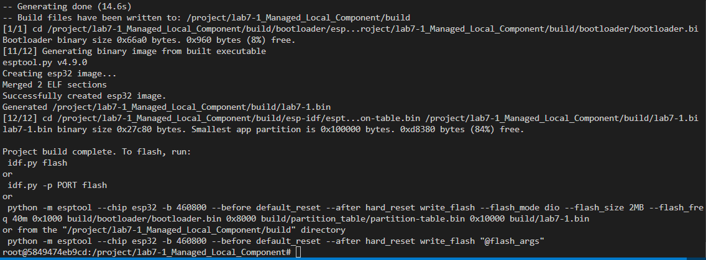

# Lab 7-1: Local Component Demo

## คำอธิบาย
การทดลองนี้แสดงการใช้งาน component ที่มีอยู่ในโฟลเดอร์ `components/Sensors/` ของ project

## สรุปคำสั่งที่ใช้ และผลลัพธ์ที่ได้

<เขียนตอบในนี้>
คำสั่งที่ใช้ ใน LAB7-1
คำสั่ง Docker Container

docker-compose up -d

คำสั่ง ตรวจสอบ Docker Container

docker-compose ps -a

คำสั่ง เข้าใช้งาน Container
docker exec -it esp32-lab7 bash
คำสั่ง เข้าไปใน project directory
cd lab7-1_Managed_Local_Component

#export environment เพื่อให้สามารถเรียกใช้ idf tools ได้
. $IDF_PATH/export.sh

คำสั่ง กำหนด target ESP32
idf.py set-target esp32

คำสั่ง Build project
idf.py build
ผลลัพธ์ที่ได้
